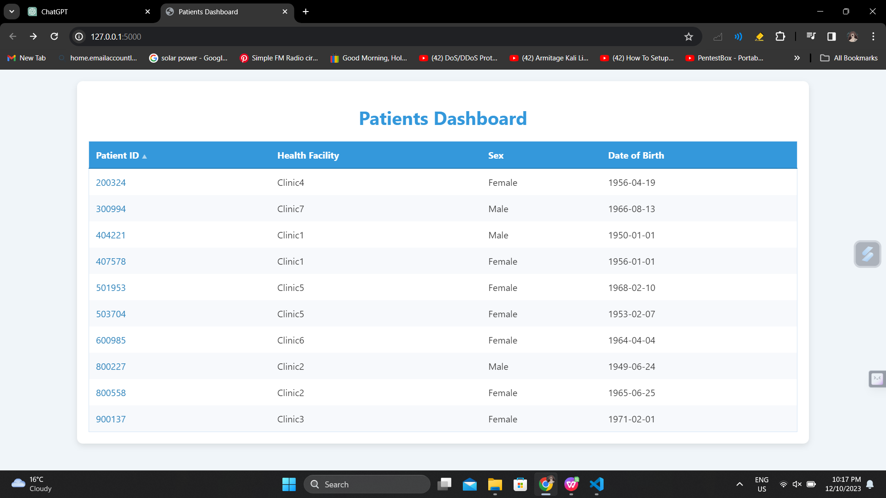
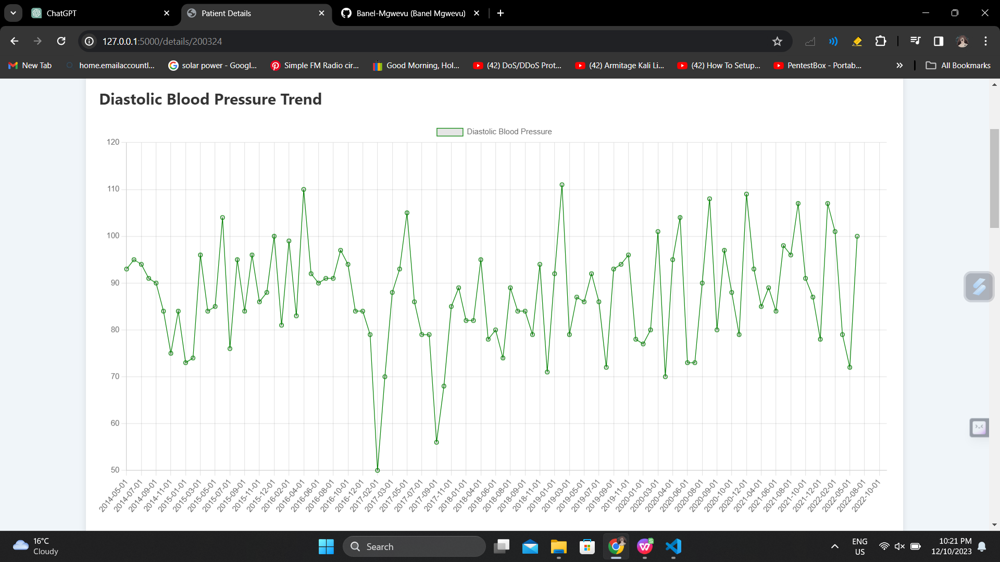
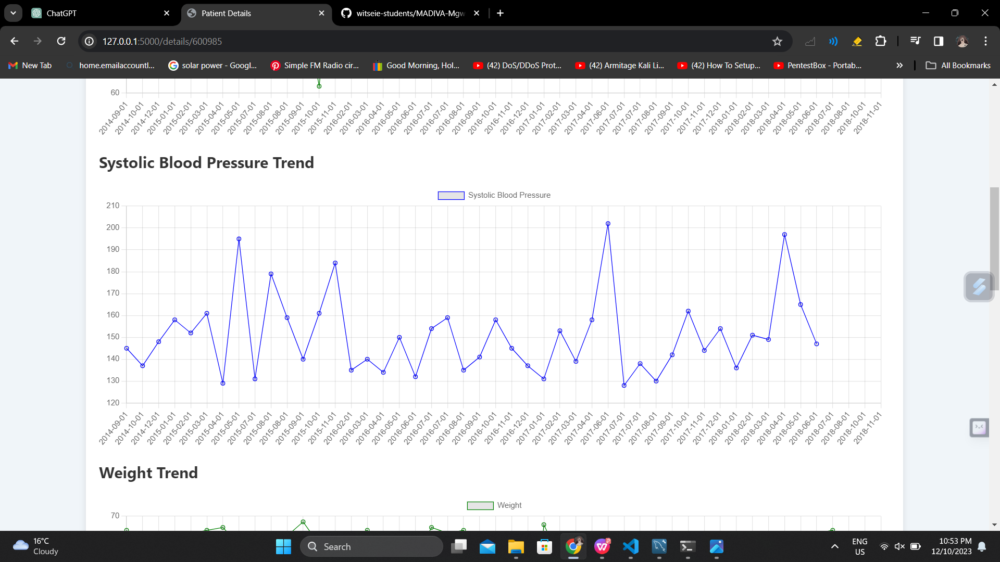
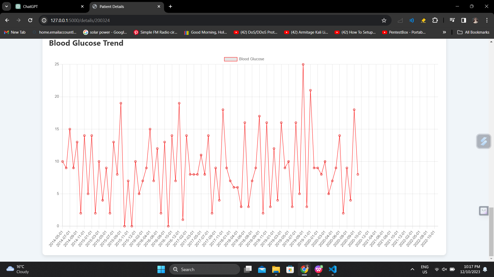
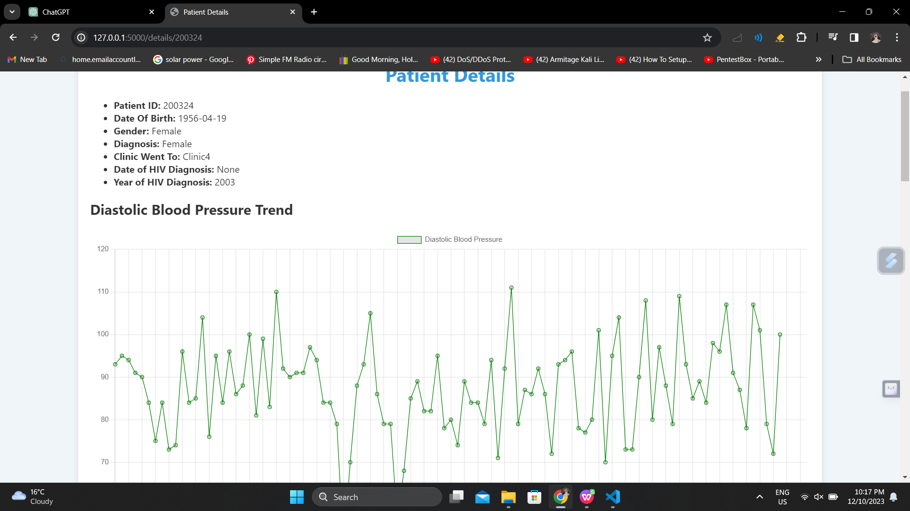

# Flask MySQL Patient Health Records Dashboard

This Flask application serves as a dashboard to visualize and manage patient health records stored in a MySQL database. The dashboard displays various health parameters and provides insights into patients' health trends over time.


## Overview

The application utilizes Python with Flask for the backend, Plotly for data visualization, and MySQL for data storage. It fetches patient health records from the MySQL database and presents them in an intuitive dashboard.

## Features

- **Dashboard**: View an overview of patient health records.
- **Detailed View**: Access detailed health data for individual patients.
- **Interactive Charts**: Visualize health parameters such as blood pressure, weight, glucose levels, etc., using interactive charts.

## Installation

### Prerequisites
- Python 3.x installed
- MySQL installed
- MySQL Workbench or any MySQL client
- Import the SQL database

### Setup Instructions
1. Clone this repository.
2. DELETE MY myenv folder
3. Install required Python packages using pip:
    ```bash
    pip install -r requirements.txt

    ```

### Setting up the MySQL Database
1. Open MySQL Workbench or any MySQL client.
2. Execute the SQL script (`patientsdb.sql`) in the `sql_scripts` directory to create the necessary database and table structure.

### Database Access Details

To access the MySQL database used by this application, you can use the following credentials:

- **Host**: `localhost`
- **Username**: `root`
- **Password**: `root`
- **Database Name**: `patientsdb`

### Configuration
- Configure MySQL credentials in the `app.py` file within the `db_config` dictionary.

## Usage

1. Start the Flask application:
    ```bash
    python app.py
    ```
2. Access the dashboard by visiting [http://localhost:5000/](http://localhost:5000/) in your web browser.
3. Click on individual patient IDs to view detailed health data.

## Directory Structure

- `app.py`: Contains the main Flask application with routes and database interactions.
- `templates/`: Includes HTML templates for rendering the dashboard and patient details.


## Screenshots



# Add other screenshots similarly...






## Acknowledgments

Thank you to the Sydney Brenner Institute for Molecular Bioscience, Wits University For The Opportunity


## Author

- [Banele Mgwevu (Checkout My Github)](https://github.com/Banel-Mgwevu)
- [Finding Issues: Setting Up Send me an Email](banelmgwevu@outlook.com)

